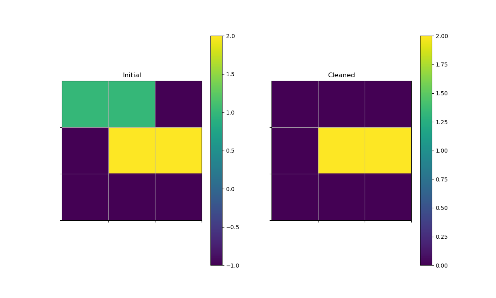

# Vaccum Cleaning Robot

This is a simple implementation of a vaccum cleaning robot written in python. 

It divides a given area into n x n grids and assigns a dirty bit to each grid.

>Obstacle : 2

>Clean Bit: 0 

>Dirty Bit: 1 

### Usage

Initially it will ask for the size of the matrix.
Currently its limited to max of 9 x 9 grid matrix. 

The second set of values are the  location of the dirty grids, <row><cols>.
This cannot exceed the grid size

The third set of values correspond to the location of the
#### Example:
>Enter the size of matrix
>3 3

>Enter dirty grids
>00 01 

>Enter obstacle grids
>11 12

#### Screenshot: 

__The blue colored square represents the dirty grids__

__The yellow squares are obstacles__

__Purple represents the clean grids__